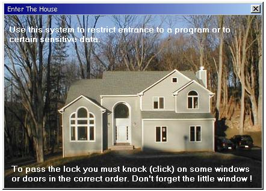



## \[ Graphic Lock\]

### Description

This is a Lock or Password with a graphic interface. My 'light' got burning after a great idea by Paul Turcksin's NoPassword submission and Chris Seelbach's Security Gate. You can use any picture and any possible sequence and number of knock-points. Imagine a photo of all the company's employies, 30 persons, where you have to click the right five in the right order. Or a beautifull landscape...next, click the second cow left of that sheep...Unlimited possibilities. Looks like an innocent stvpid picture, but it's hard to crack! Be sure to read all the comments inside the program ! All your comments and new idea's are most welcome :-)
 
### More Info
 

             |
---                |---
**Submitted On**   |2004-10-10 12:41:02
**By**             |[D\. Rijmenants](https://github.com/Planet-Source-Code/PSCIndex/blob/master/ByAuthor/d-rijmenants.md)
**Level**          |Beginner
**User Rating**    |4.9 (44 globes from 9 users)
**Compatibility**  |VB 5\.0, VB 6\.0
**Category**       |[Miscellaneous](https://github.com/Planet-Source-Code/PSCIndex/blob/master/ByCategory/miscellaneous__1-1.md)
**World**          |[Visual Basic](https://github.com/Planet-Source-Code/PSCIndex/blob/master/ByWorld/visual-basic.md)
**Archive File**   |[\[\_Graphic\_18036310102004\.zip](https://github.com/Planet-Source-Code/d-rijmenants-graphic-lock__1-56647/archive/master.zip)

